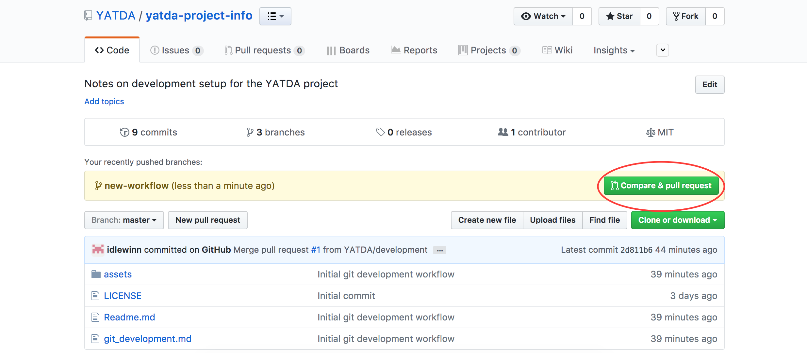
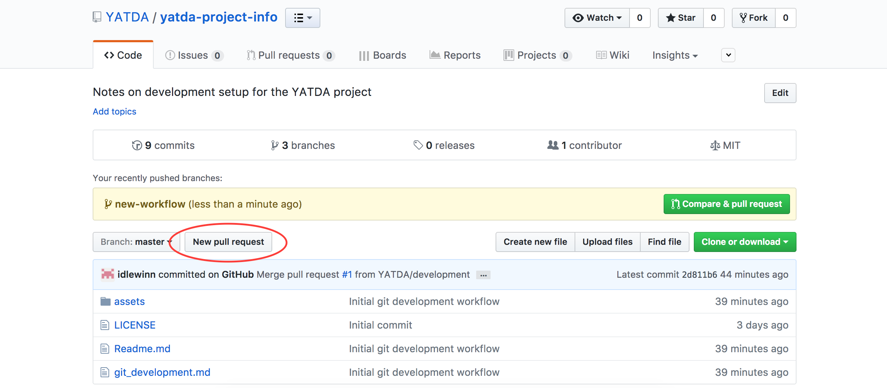
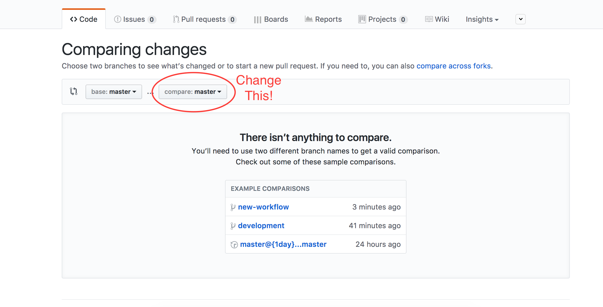
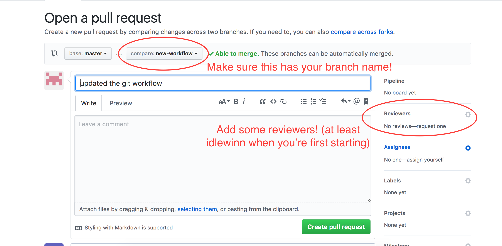

# Documentation
[Here's some documentation on Git.](https://git-scm.com/)

# Clone the repository
In your terminal, go to a folder you'd like to develop in. For example, `Documents/repos`. Clone the repo into your account.
```
git clone https://github.com/YATDA/YATDA
```

This is all the setup you need for development.

# Terminology

Before we get into development, lets go over some quick terminology:

Local Repository - the repository you cloned onto your hard drive. You make changes to it and then push those changes to the online repository.

Main/GitHub/Online Repository - The repository that everyone can see. After you make changes, you push to this repository 

Project directory - This is the base folder if your repository. It has a `package.json` file in it, as well as a `Readme.md` file.
# The Development Process

**Workflow - allows for multi-branch development:**
1. `git checkout master` - This may be unnecessary (especially if you just cloned the repository), but you should do this to make sure you're not on a branch (if you don't know what a branch is, more on that later).
2. `git fetch` - pulls the latest changes from the GitHub repo's master branch.
3. `git rebase origin/master` - This will update your local master branch with the changes just fetched.
4. `git checkout -b username-branchname` - replace "username-branchname" with your username something that makes sense to you. Usually, something related to the task you're working on e.g. `idlewinn-gitdevelopment`. This will create a new branch in the local repository. Any changes you make will not be reflected in the master branch.
5. Development - do some work on your task(s).
6. `git add .` from the project directory. This will add all changes you made to your LOCAL repository.
7. `git commit` from the project directory. This will commit all changes that you've added to the LOCAL repository.
8. Repeat steps 4-6 often so it's easy to revert changes. When you're ready to push your changes to master, proceed to step 9.
9. `git fetch origin master` - This grabs the latest changes from the master branch
10. `git rebase origin/master` - This applies any changes you've made on top of the latest changes from the master branch. This can cause merge conflicts - you can resolve them in VS Code. [Merge Conflicts in VS Code](https://code.visualstudio.com/docs/editor/versioncontrol#_merge-conflicts) - If you run into merge conflicts, resolve them and then run `git rebase --continue` or follow git's instructions.
11. `git push origin username-branchname` - again, replace "username-branchname" with the actual name you used. This will push all changes on your current branch to the same branch on the GitHub repository. At this point, you can look at the online repository and there should be an option to submit a pull request.

This is the summary of our development workflow - aside from interacting with GitHub, this is all you will do locally. Each time you want to start a new task, start from #1 and work your way to the end.
# Submitting pull requests on GitHub

Submitting pull requests is how we ensure that all code that goes into our repository is at least:
1. Reviewed by someone else
2. Passes our tests

If you recently made a commit, you might see this when you visit our repository on GitHub.


If you made it commit but it wasn't recent, you might have to manually initialize a pull request.


When you manually initialize a pull request, you'll have to choose the branch that you want to merge (the **compare** branch) into the master branch (the **base** branch). 


Either way, you should end up here, where the **compare** branch is your branch name. You should also add reviewers (**idlewinn**, for now):


Write a title and description for your commit so a reviewer can quickly understand the changes you made and why. Then, click *Create Pull Request*.

After a reviewer looks at the code, they will either approve it or give feedback (or both). Make sure you address any feedback, and when everything is ready you'll be able to merge your changes. 

After you merge, you will be prompted to delete your branch. You should, because it will help keep the repository clean. Your changes will be in the master branch anyway.

That's our development workflow!
