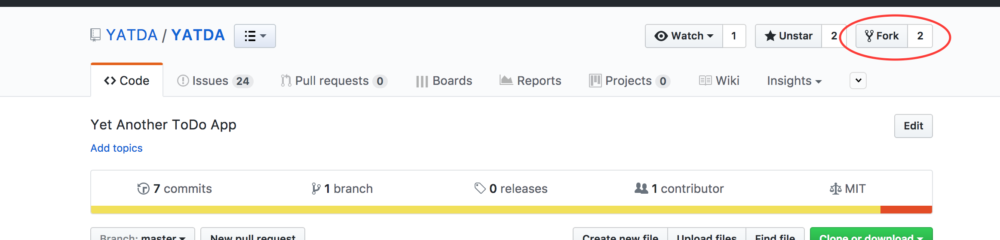

# Documentation
[Here's some documentation on for Git.](https://git-scm.com/)

# Setting up YATDA repository management
In your terminal, go to a folder you'd like to develop in. For example, `Documents/repos`. Start off by forking the [YATDA/YATDA](https://github.com/YATDA/YATDA) repository into your own account.


# Clone your new repository
In your terminal, go to a folder you'd like to develop in. For example, `Documents/repos`. Clone your version of the repo into your account.
```
git clone https://github.com/${username}/YATDA
```

# Create a new link to the main repository
```
git remote add yatda https://github.com/YATDA/YATDA
```

This will allow you to push and pull from the main repository.

This is all you need to set up your repository for development.

# The Development Process

1. `git pull yatda master` - always start with this. It will pull down any updates to the main repo since you last did any development.
2. `git checkout -b branchname` - replace "branchname" with something that makes sense to you. Usually, something related to the task you're working on.
2. Development
3. `git add .` from the base YATDA folder. This will add all changes you made to your LOCAL repository.
4. `git commit` from the base YATDA folder. This will commit all changes that you've added to the LOCAL repository.
5. Repeat steps 2-5 often so it's easy to revert changes. When you're ready to push your changes to master, proceed to step 6.
6. `git rebase 